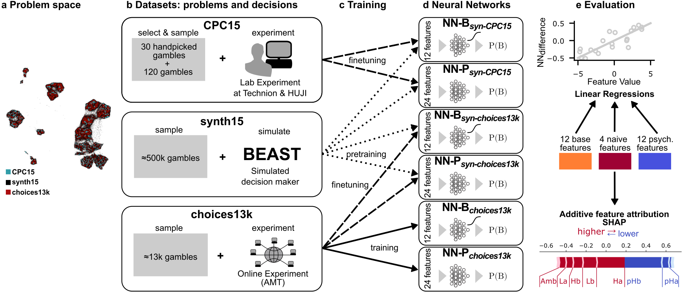

# Title
This is the official repository, containing code and data for the paper (title) (currently under review).



## Data
All three ([CPC15](https://economics.agri.huji.ac.il/crc2015/raw-data), [CPC18](https://cpc-18.com/data/) and [choices13k](https://github.com/jcpeterson/choices13k)) datasets used in this study were already publicly available before (click on the names, to see more).
Aggregate versions (containing no individual data anymore), with additional features and some utility columns are stored in the [data folder](./data/).

## Analysis
The [Analysis notebook](./Analysis.ipynb) shows how to reproduce many of the plots and analysis done in the paper.

## Models
Pretrained models (under the name that they were shown in Table 1 in the paper) are stored in the [models folder](./models).  
The [models notebook](./NNs.ipynb) gives simple examples how to load, save and train the NN models discussed in the paper.
The underlying source code for them is in the [src folder](./src).

## Usage
To use the notebooks and reproduce our results, install the conda environment, using
```
conda env create -f environment.yml
conda activate DecisionMaking
```

## Citation
The paper is currently under reiew.
